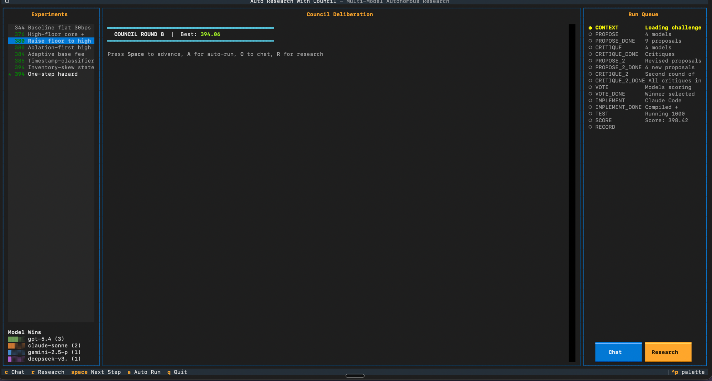

# Auto Research with Council

**Multi-model autonomous research. Describe a problem, let a committee of LLMs solve it overnight.**

Give it any optimization problem — a website URL and a simulator repo — and it sets up the challenge, then runs an infinite loop where multiple AI models (Claude, GPT, Grok, Gemini, DeepSeek) brainstorm ideas, critique each other anonymously, vote on what to try, implement the winner, test it, and repeat. You go to sleep, wake up to results.

Three tools:
1. **`create_challenge.py`** — describe a problem in plain text, it builds the challenge folder
2. **`council run`** — runs the multi-model research loop on any challenge
3. **`deep_research.py`** — generate prompts for external deep research tools, import findings mid-run

Inspired by [karpathy/autoresearch](https://github.com/karpathy/autoresearch), but instead of one model iterating alone, a council of models from different providers collaborates to find solutions faster.

## Flow

```
┌──────────────────────────────────────────────────────────────────┐
│                     CREATE CHALLENGE                             │
│                                                                  │
│  "The problem is at https://... the repo is https://..."         │
│                          │                                       │
│                          ▼                                       │
│              Claude Code reads URLs,                             │
│              clones repo, creates                                │
│              program.md + setup.sh                               │
│                          │                                       │
│                          ▼                                       │
│              Challenge folder ready                              │
└──────────────────────────────────────────────────────────────────┘
                           │
                           ▼
┌──────────────────────────────────────────────────────────────────┐
│                     COUNCIL RUN (loops forever)                  │
│                                                                  │
│  ┌────────────────────────────────────────────────────────────┐  │
│  │ CONTEXT — load all exp/* branches, best score, target file │  │
│  │           + deep research findings if available            │  │
│  └────────────────────────┬───────────────────────────────────┘  │
│                           ▼                                      │
│  ┌────────────────────────────────────────────────────────────┐  │
│  │ PROPOSE — each model suggests 3 ideas (anonymous)          │  │
│  │                                                            │  │
│  │   Claude: "try inventory-based fee skewing"                │  │
│  │   GPT:    "use hazard state machine for arb detection"     │  │
│  │   Gemini: "adaptive volatility thresholds"                 │  │
│  └────────────────────────┬───────────────────────────────────┘  │
│                           ▼                                      │
│  ┌────────────────────────────────────────────────────────────┐  │
│  │ CRITIQUE — each model reviews all proposals (anonymous)    │  │
│  │                                                            │  │
│  │   "Proposal #2 is strong but threshold needs tuning"       │  │
│  │   "Proposal #1 overlaps with exp/388, which scored poorly" │  │
│  └────────────────────────┬───────────────────────────────────┘  │
│                           ▼                                      │
│  ┌────────────────────────────────────────────────────────────┐  │
│  │ PROPOSE 2 — revised ideas informed by critiques            │  │
│  └────────────────────────┬───────────────────────────────────┘  │
│                           ▼                                      │
│  ┌────────────────────────────────────────────────────────────┐  │
│  │ CRITIQUE 2 — second round of review                        │  │
│  └────────────────────────┬───────────────────────────────────┘  │
│                           ▼                                      │
│  ┌────────────────────────────────────────────────────────────┐  │
│  │ VOTE — each model scores 0-100                             │  │
│  │                                                            │  │
│  │   #1  ████████████████░░░░  160/200  "hazard pulse"        │  │
│  │   #2  █████████████░░░░░░░  130/200  "inventory skew"      │  │
│  │   #3  ██████████░░░░░░░░░░  105/200  "vol thresholds"      │  │
│  └────────────────────────┬───────────────────────────────────┘  │
│                           ▼                                      │
│  ┌────────────────────────────────────────────────────────────┐  │
│  │ IMPLEMENT — Claude Code writes the code change             │  │
│  │                                                            │  │
│  │   Reading: strategy.sol                                    │  │
│  │   Editing: strategy.sol                                    │  │
│  │   $ uv run amm-match validate strategy.sol                 │  │
│  │   ✓ Compiled  ✓ Validated                                  │  │
│  └────────────────────────┬───────────────────────────────────┘  │
│                           ▼                                      │
│  ┌────────────────────────────────────────────────────────────┐  │
│  │ TEST — run evaluation                                      │  │
│  │                                                            │  │
│  │   Score: 412.83  ← NEW BEST                                │  │
│  └────────────────────────┬───────────────────────────────────┘  │
│                           ▼                                      │
│  ┌────────────────────────────────────────────────────────────┐  │
│  │ RECORD — git branch exp/412-hazard-pulse                   │  │
│  │          commit: score, proposer, votes, critiques, diff   │  │
│  └────────────────────────┬───────────────────────────────────┘  │
│                           │                                      │
│                           ▼                                      │
│                    ┌─────────────┐                               │
│                    │  NEXT ROUND │ ──────────────────────────┐   │
│                    └─────────────┘                            │   │
│                                                              │   │
│  ┌───────────────────────────────────────────────────────────┘   │
│  │                                                               │
│  └──▶ Back to CONTEXT (now with one more experiment branch)      │
│                                                                  │
└──────────────────────────────────────────────────────────────────┘

                    ┌─────────────────────────────┐
                    │  DEEP RESEARCH (anytime)     │
                    │                              │
                    │  Terminal 2, while council    │
                    │  runs in Terminal 1:          │
                    │                              │
                    │  1. Generate research prompt  │
                    │  2. Paste into ChatGPT/       │
                    │     Perplexity/etc.           │
                    │  3. Import findings back      │
                    │  4. Next round picks them up  │
                    └─────────────────────────────┘
```

## Quick Start

```bash
# Install
git clone https://github.com/mirrormystic/auto_research_with_council.git
cd auto_research_with_council
uv sync
```

### Step 1: Create a Challenge

Describe any optimization problem in plain text. Include URLs to the problem page and simulator repo.

```bash
uv run python create_challenge.py --output ./my-challenge
```

Then type your description:

```
The problem is at https://www.optimizationarena.com/amm
The simulator repo is https://github.com/benedictbrady/amm-challenge
You need to write a Solidity fee strategy that maximizes the edge score.
The competitor charges a flat 30bps fee.
```

Press Ctrl+D. Claude Code reads the URLs, clones the repo, understands the simulator, and creates a ready-to-run challenge folder with `program.md`, target file, reference files, and a setup script.

Then install the simulator:

```bash
cd my-challenge
./setup.sh
```

Or use the included example challenge (already set up):

```bash
# Skip create_challenge.py and use the built-in AMM example
ls examples/amm-challenge/
```

### Step 2: Run the Council

```bash
# With OpenRouter API key
uv run council run \
  --openrouter-key sk-or-v1-... \
  --models "anthropic/claude-sonnet-4-6,openai/gpt-5.4" \
  --challenge ./my-challenge

# Or with Tempo MPP (no API key needed)
uv run council run \
  --tempo \
  --models "anthropic/claude-sonnet-4-6,openai/gpt-4o" \
  --challenge ./my-challenge
```

It runs forever. Ctrl+C to stop. Restart anytime — it reads all past experiments from git and picks up where it left off.

### Step 3: Deep Research (optional, anytime)

When the council gets stuck, use external deep research tools to break through.

**In a second terminal** (while the council is still running):

```bash
# Generate a research prompt with full context
uv run python deep_research.py --challenge ./my-challenge
```

This prints a detailed prompt containing: the problem, every experiment tried, the best code, the score gap, and specific research questions. Copy it and paste into ChatGPT Deep Research, Perplexity, or any research tool.

When you get results back:

```bash
# Import the findings
uv run python deep_research.py --challenge ./my-challenge --import
```

Paste the research findings, press Ctrl+D. They're saved to `research_findings.md` in the challenge folder. The council picks them up automatically on the next round — no restart needed.

You can do this multiple times. Each import appends to the file, so findings accumulate.

## How the Council Works

```
PROPOSE   → each model suggests 3 ideas (anonymous, parallel)
CRITIQUE  → each model reviews all proposals (anonymous)
PROPOSE 2 → models revise/combine ideas informed by critiques
CRITIQUE 2→ second round of anonymous review
VOTE      → each model scores every proposal 0-100, highest total wins
IMPLEMENT → Claude Code writes the code change (streamed live)
TEST      → run evaluation, extract score
RECORD    → git branch + commit with full deliberation log
REPEAT    → forever
```

Every proposal, critique, and vote uses **structured tool calling** with Pydantic validation — no fragile JSON parsing.

Each experiment is recorded as a git branch with a detailed commit message: the score, who proposed it, vote breakdown, key critiques, and the implementation diff.

## CLI Reference

### `council run`

```
--tempo                Pay via Tempo MPP
--openrouter-key KEY   Pay via OpenRouter API key
--models MODELS        Comma-separated model list (required)
--challenge PATH       Path to challenge folder (default: current dir)
--rounds N             Number of deliberation rounds (default: 3)
```

### `create_challenge.py`

```bash
uv run python create_challenge.py --output PATH
```

### `deep_research.py`

```bash
# Generate research prompt
uv run python deep_research.py --challenge PATH

# Import findings
uv run python deep_research.py --challenge PATH --import
```

### Example Commands

```bash
# Quick test with 2 cheap models
uv run council run --openrouter-key sk-or-... \
  --models "openai/gpt-4o-mini,google/gemini-2.0-flash-001" \
  --challenge ./examples/amm-challenge

# Full council with frontier models
uv run council run --openrouter-key sk-or-... \
  --models "anthropic/claude-sonnet-4-6,openai/gpt-5.4,google/gemini-2.5-pro" \
  --challenge ./examples/amm-challenge

# Fewer deliberation rounds (faster)
uv run council run --openrouter-key sk-or-... --rounds 2 \
  --models "anthropic/claude-sonnet-4-6,openai/gpt-4o" \
  --challenge ./my-challenge

# Verbose debug logging on screen
COUNCIL_LOG_LEVEL=DEBUG uv run council run --openrouter-key sk-or-... \
  --models "openai/gpt-4o-mini" \
  --challenge ./examples/amm-challenge

# Pay with Tempo instead of API key
uv run council run --tempo \
  --models "anthropic/claude-sonnet-4-6,openai/gpt-4o" \
  --challenge ./examples/amm-challenge
```

### Tempo Setup (optional)

```bash
curl -fsSL https://tempo.xyz/install | bash
tempo wallet login
tempo wallet fund
# Then use --tempo instead of --openrouter-key
```

## Create Your Own Challenge (Manual)

If you prefer to set up a challenge folder by hand instead of using `create_challenge.py`:

A challenge is a git folder with a `program.md`. The frontmatter defines the mechanics, the body describes the problem:

```yaml
---
target_file: train.py
reference_files: [utils.py]
validate: "python -c 'import train'"
eval: "python train.py"
metric_regex: "val_loss: ([\\d.]+)"
direction: minimize
---

# My Optimization Problem

Describe the problem here. The models see this entire file...
```

See [GUIDE.md](GUIDE.md) for the full format or `examples/amm-challenge/` for a working example.

## Next Version Demo

Interactive terminal demo showing the next version's UI — a retro-style TUI where you can watch the council deliberate, chat with agents, and trigger deep research. No LLM calls, all simulated with real experiment data.



```bash
uv sync --extra demo
uv run council-demo
```

| Key | Action |
|-----|--------|
| Space | Advance one step |
| A | Auto-run (watch it go) |
| C | Open chat with agents |
| R | Open deep research prompt |
| Q | Quit |

## Architecture

- **Structured output**: Pydantic schemas → OpenRouter tool calling → validated typed responses
- **Anonymous deliberation**: Models don't know who proposed what during critique and voting
- **Payment flexibility**: `--tempo` (Tempo MPP) or `--openrouter-key` (standard API key)
- **Git as state**: Stop and restart anytime — reads all `exp/*` branches on startup
- **Deep research**: Import external findings mid-run, models see them next round
- **Full audit trail**: `council.log` at DEBUG level, `COUNCIL_LOG_LEVEL=DEBUG` for screen

## Built With

- [OpenRouter](https://openrouter.ai) — unified API for all models
- [Tempo MPP](https://mpp.dev) — machine-to-machine payments (optional)
- [Pydantic](https://pydantic.dev) — structured output validation
- [Claude Code](https://claude.ai/code) — implementation agent

## License

MIT
